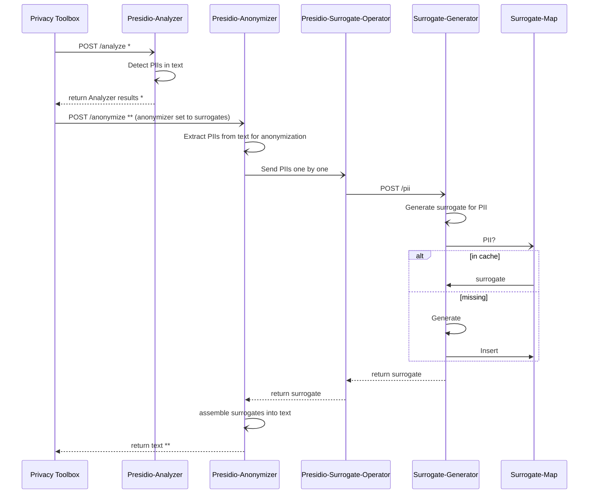

# Surrogates

## Usage

After starting the server, go to `http://127.0.0.1:8000/docs` to read the API documentation.

### Configuration

The server requires two environment variables at startup, or it exits with an
error:

- `SURROGATE_MAP_FILE`: path to the surrogate map. The extension selects the
  backend (`.db`/`.sqlite` for SQLite, `.json` for JSON). The file is created
  if it does not exist.
- `SURROGATE_NAMES_DB_FILE`: path to the names CSV (`name,gender` columns) used
  to generate person-name surrogates.

For local development, copy `.env.dist` to `.env` and fill in both paths; the
server loads `.env` automatically.

### Local

```shell
uv run fastapi dev
```

### Dockerize

```shell
docker build -t fastapi-app .
docker run -p 8000:80 \
  -e SURROGATE_MAP_FILE=/data/surrogate_map.db \
  -e SURROGATE_NAMES_DB_FILE=/data/names.csv \
  -v "$(pwd)/data:/data" \
  fastapi-app
```

## fast API

Launch FastAPI server with `uv run fastapi dev`.

## Import an Existing Map

To load an existing surrogate map into the surrogate service, you may use the helper script [`import-surrogate-map`](tools/scripts/import-surrogate-map).

## Presidio Integration

Here is the expected flow of this module for its integration with Presidio.

Key references:

- \*[Presidio API documentation for Analyzer](https://microsoft.github.io/presidio/api-docs/api-docs.html#tag/Analyzer)
- \*\*[Presidio API documentation for Anonymizer](https://microsoft.github.io/presidio/api-docs/api-docs.html#tag/Anonymizer)


