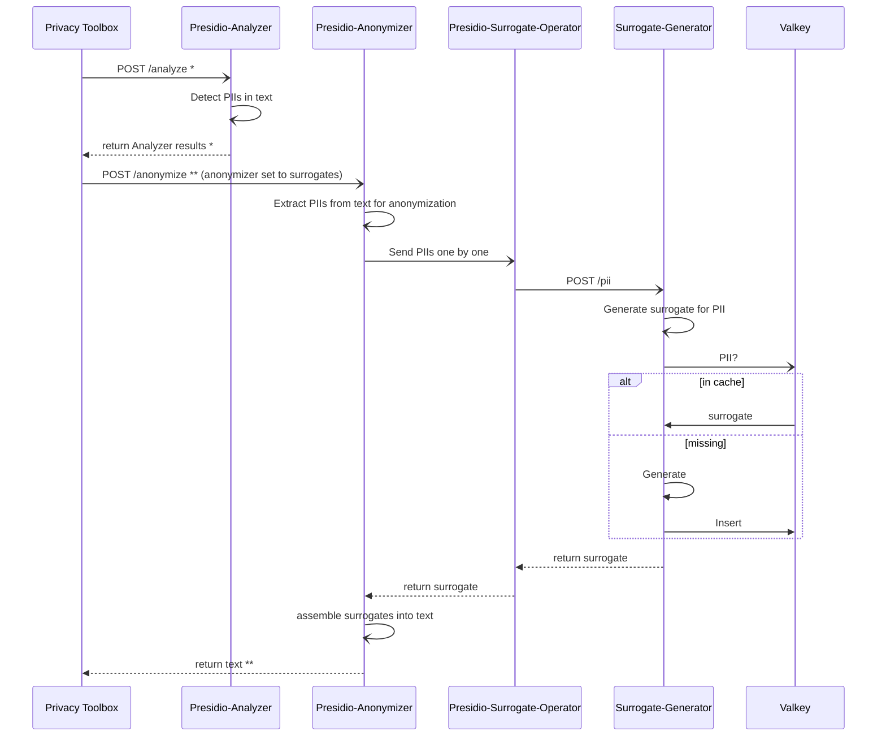

# Surrogates

## Usage

After starting the server, go to `http://127.0.0.1:80/docs` to read the API documentation.

### Local

```python
uv run fastapi dev
```

### Dockerize

```
docker build -t fastapi-app .
docker run -p 8000:80 fastapi-app
```

## fast API

Launch FastAPI server with `uv run fastapi dev`. 

## Import an Existing Map

To load an existing surrogate map into the surrogate service, you may use the helper script [`import-surrogate-map`](tools/scripts/import-surrogate-map).

## Presidio Integration

Here is the expected flow of this module for its integration with Presidio.

Key references:

- *[Presidio API documentation for Analyzer](https://microsoft.github.io/presidio/api-docs/api-docs.html#tag/Analyzer)
- **[Presidio API documentation for Anonymizer](https://microsoft.github.io/presidio/api-docs/api-docs.html#tag/Anonymizer)



