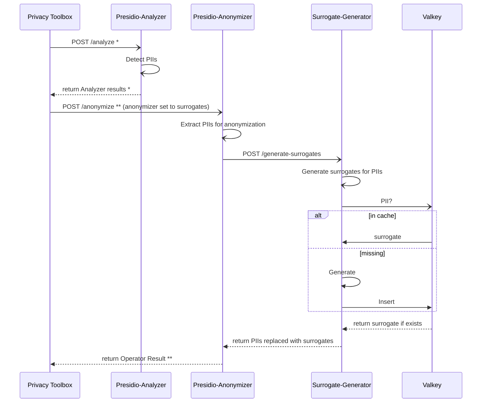

# Surrogates

## set-up

```python
uv sync
uv run main.py
```

## fast API

### POST /pii

## Presidio Integration

Here is the expected flow of this module for its integration with Presidio.

Key references:

- *[Presidio API documentation for Analyzer](https://microsoft.github.io/presidio/api-docs/api-docs.html#tag/Analyzer)
- **[Presidio API documentation for Anonymizer](https://microsoft.github.io/presidio/api-docs/api-docs.html#tag/Anonymizer)




