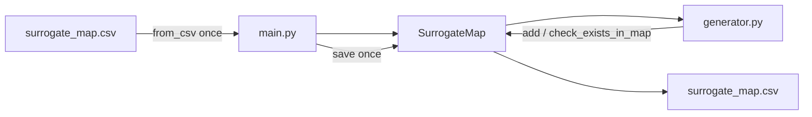

# SurrogateMap: in-memory cache, CSV only at boundaries

## Problem today

[`main.py`](../main.py) already loads the map **once** and saves **once**:

```text
load_surrogate_map(path) → generate_surrogates(...) → save_surrogate_map(...)
```

The expensive pattern is **inside generation**: every new mapping does:

```python
new_entry = pd.DataFrame({'word': [name], 'surrogate': [surrogate], 'entity': ['[[NAME]]']})
surrogate_map = pd.concat([surrogate_map, new_entry], ignore_index=True)
```

That rebuilds a DataFrame on **every** `add` (~15 entity helpers × N input rows). Lookup uses `iterrows()` + fuzzy match — also O(n) per token.

Goal: hold mappings in an in-memory structure during the run; **read CSV once**, **write CSV once**.

## Entry shape (pandas vs cache)

`pd.DataFrame({'word': [name], ...})` uses **lists** because DataFrame columns are series. In a Python cache, use **scalars**:

```python
# One mapping
{"word": "Marie", "surrogate": "Alice", "entity": "[[NAME]]"}

# Not this (pandas artifact only)
{"word": ["Marie"], "surrogate": ["Alice"], "entity": ["[[NAME]]"]}
```

## Internal storage

A single **ordered list** is the source of truth. Fuzzy lookup scans the list and returns the **first** match with score > 80 (same behavior as today’s `token_exist_in_map`). No `_exact` index.

```python
self._entries: list[MapEntry] = []
```

---

## Full `SurrogateMap` implementation ([`loader.py`](../loader.py))

Copy this into `loader.py` (add `from fuzzywuzzy import fuzz` at module top). Replaces the current DataFrame-backed stub.

```python
from __future__ import annotations

import os
from dataclasses import dataclass

import pandas as pd
from fuzzywuzzy import fuzz


@dataclass(frozen=True, slots=True)
class MapEntry:
    word: str
    surrogate: str
    entity: str


class SurrogateMap:
    """In-memory surrogate map. CSV is read at load and written at save only."""

    def __init__(self) -> None:
        self._entries: list[MapEntry] = []
        self._dirty: bool = False

    # -------------------------------------------------------------------------
    # Construction / persistence
    # -------------------------------------------------------------------------

    @classmethod
    def from_csv(cls, path: str | None) -> SurrogateMap:
        """Load existing map from CSV, or start empty."""
        sm = cls()
        if path and os.path.exists(path):
            df = pd.read_csv(path)
            for row in df.itertuples(index=False):
                sm.add(row.word, row.surrogate, row.entity, mark_dirty=False)
        return sm

    def to_dataframe(self) -> pd.DataFrame:
        """Export for CSV save or text-replacement utility."""
        if not self._entries:
            return pd.DataFrame(columns=["word", "surrogate", "entity"])
        return pd.DataFrame(
            [
                {"word": e.word, "surrogate": e.surrogate, "entity": e.entity}
                for e in self._entries
            ]
        )

    def save(self, path: str | None) -> None:
        """Write map to CSV once at end of pipeline."""
        if not path:
            return
        self.to_dataframe().to_csv(path, index=False, encoding="utf-8")
        self._dirty = False

    # -------------------------------------------------------------------------
    # Runtime mutations / lookups (used by generator)
    # -------------------------------------------------------------------------

    def add(
        self,
        word: str,
        surrogate: str,
        entity: str,
        *,
        mark_dirty: bool = True,
    ) -> None:
        """Append one mapping. Replaces pd.concat + new_entry."""
        self._entries.append(
            MapEntry(word=word, surrogate=surrogate, entity=entity)
        )
        if mark_dirty:
            self._dirty = True

    def check_exists_in_map(
        self,
        token: str,
        threshold: int = 80,
    ) -> tuple[bool, str | None]:
        """
        Fuzzy lookup: first entry where token_sort_ratio > threshold.
        Replaces token_exist_in_map in generator.py.
        """
        if not self._entries:
            return False, None

        token_lower = token.lower()
        for entry in self._entries:
            if fuzz.token_sort_ratio(token_lower, entry.word.lower()) > threshold:
                return True, entry.surrogate
        return False, None

    def __len__(self) -> int:
        return len(self._entries)

    @property
    def dirty(self) -> bool:
        return self._dirty


# -----------------------------------------------------------------------------
# Factory (used by main.py)
# -----------------------------------------------------------------------------

def load_surrogate_map(path: str | None = None) -> SurrogateMap:
    return SurrogateMap.from_csv(path)
```

### API summary

| Method | Replaces | Responsibility |
|--------|----------|----------------|
| `SurrogateMap.from_csv(path)` | `load_surrogate_map` returning DataFrame | Read CSV once into `_entries` |
| `add(word, surrogate, entity)` | `pd.concat` + `new_entry` | Append one mapping |
| `check_exists_in_map(token)` | `token_exist_in_map` | `(found: bool, surrogate: str \| None)` |
| `save(path)` | `save_surrogate_map` | Write CSV at end of run |
| `to_dataframe()` | — | For `replace_orig_text_with_surrogate` |

---

## Generator usage examples

### `generate_location_surrogate` (typical entity helper)

**Before:**

```python
def generate_location_surrogate(text, surrogate_map):
    exists, surrogate = token_exist_in_map(text, surrogate_map)
    if exists:
        return surrogate, surrogate_map

    if re.match(r'^[\d\s,-]+$', text):
        surrogate = replace_digits(text)
    else:
        surrogate = 'Ville_' + text[0].upper()

    new_entry = pd.DataFrame({
        'word': [text],
        'surrogate': [surrogate],
        'entity': ['[[LOCATION]]'],
    })
    surrogate_map = pd.concat([surrogate_map, new_entry], ignore_index=True)
    return surrogate, surrogate_map
```

**After:**

```python
from .loader import SurrogateMap

def generate_location_surrogate(text: str, surrogate_map: SurrogateMap) -> tuple[str, SurrogateMap]:
    exists, surrogate = surrogate_map.check_exists_in_map(text)
    if exists:
        return surrogate, surrogate_map

    if re.match(r'^[\d\s,-]+$', text):
        surrogate = replace_digits(text)
    else:
        surrogate = 'Ville_' + text[0].upper()

    surrogate_map.add(text, surrogate, '[[LOCATION]]')
    return surrogate, surrogate_map
```

### `generate_name_surrogate` (lookup at full text and per token)

**Before:**

```python
exists, surrogate = token_exist_in_map(text, surrogate_map)
# ...
exists, surrogate = token_exist_in_map(name, surrogate_map)
# ...
new_entry = pd.DataFrame({'word': [name], 'surrogate': [surrogate], 'entity': ['[[NAME]]']})
surrogate_map = pd.concat([surrogate_map, new_entry], ignore_index=True)
```

**After:**

```python
def generate_name_surrogate(
    text: str,
    surrogate_map: SurrogateMap,
    name_db: NameDatabase,
) -> tuple[str, SurrogateMap]:
    exists, surrogate = surrogate_map.check_exists_in_map(text)
    if exists:
        return surrogate, surrogate_map

    surrogate_name = ''
    names = text.split()
    for name in names:
        if re.match(r'^(Dr\.|Mr\.|Mrs\.|Ms\.|Prof\.|Mme\.|M\.|Mme|M|Dr|Mr|Ms|Mrs|Prof)$', name):
            surrogate_name += name + ' '
            continue

        exists, surrogate = surrogate_map.check_exists_in_map(name)
        if exists:
            surrogate_name += surrogate + ' '
        else:
            d = gender.Detector()
            predicted_gender = d.get_gender(text)
            first_letter = name[0]
            surrogate = name_db.pick_random(predicted_gender, first_letter)
            surrogate_name += surrogate + ' '
            surrogate_map.add(name, surrogate, '[[NAME]]')

    return surrogate_name, surrogate_map
```

### `generate_surrogates` (orchestrator — unchanged shape)

```python
def generate_surrogates(
    input: pd.DataFrame,
    surrogate_map: SurrogateMap,
    name_db: NameDatabase,
    parameters: dict | None = None,
) -> tuple[pd.DataFrame, SurrogateMap]:
    if parameters is None:
        parameters = {'year_shift': 3}

    for idx, row in input.iterrows():
        entity = row['entity']
        text = row['word']

        if entity == '[[NAME]]':
            surrogate, surrogate_map = generate_name_surrogate(text, surrogate_map, name_db)
        elif entity == '[[LOCATION]]':
            surrogate, surrogate_map = generate_location_surrogate(text, surrogate_map)
        elif entity == '[[DATE]]':
            surrogate, surrogate_map = generate_date_surrogate(
                text, surrogate_map, parameters['year_shift']
            )
        # ... other entity branches unchanged in structure ...
        else:
            surrogate = text

        input.at[idx, 'surrogate'] = surrogate

    return input, surrogate_map
```

### Remove from `generator.py`

- `token_exist_in_map` (logic lives in `SurrogateMap.check_exists_in_map`)
- All `pd.concat([surrogate_map, new_entry], ...)` blocks
- `from fuzzywuzzy import fuzz` in generator (only needed in loader)

---

## Orchestration ([`main.py`](../main.py))

```python
from .loader import load_input, load_surrogate_map, load_name_database, save_output
from .generator import generate_surrogates

def main(input_file, output_file, surrogate_map_path=None):
    input_df = load_input(input_file)
    surrogate_map = load_surrogate_map(surrogate_map_path)
    name_db = load_name_database()

    if input_df is not None:
        output, surrogate_map = generate_surrogates(input_df, surrogate_map, name_db)
        save_output(output, output_file)
        surrogate_map.save(surrogate_map_path)
```

---

## `replace_orig_text_with_surrogate`

```python
def replace_orig_text_with_surrogate(orig_text_path, surrogate_map_path, output_text_path):
    with open(orig_text_path, 'r', encoding='utf-8') as f:
        orig_text = f.read()

    surrogate_map = SurrogateMap.from_csv(surrogate_map_path)
    if len(surrogate_map) == 0:
        print(f"Surrogate map file {surrogate_map_path} not found or empty. Exiting.")
        with open(output_text_path, 'w', encoding='utf-8') as f:
            f.write(orig_text)
        return

    df = surrogate_map.to_dataframe()
    df['word_length'] = df['word'].str.len()
    df = df.sort_values(by='word_length', ascending=False)

    for row in df.itertuples(index=False):
        pattern = r'\b' + re.escape(row.word) + r'\b'
        orig_text = re.sub(pattern, row.surrogate, orig_text, flags=re.IGNORECASE)

    with open(output_text_path, 'w', encoding='utf-8') as f:
        f.write(orig_text)
```

---

## Data flow



---

## Migration checklist

1. Replace DataFrame-backed `SurrogateMap` stub with the full class above.
2. Move `fuzz` import and fuzzy logic into `check_exists_in_map`.
3. Update every `generate_*` helper: `check_exists_in_map` + `add`.
4. Delete `token_exist_in_map` and all `pd.concat` / `new_entry` code from `generator.py`.
5. Update `main.py` to call `surrogate_map.save(path)`.
6. Update `replace_orig_text_with_surrogate` to use `SurrogateMap.from_csv`.

## Tests to add later

- Load CSV → `add` → `save` → reload round-trip
- `check_exists_in_map` matches case variants (e.g. `marie` vs `Marie`)
- Two `add` calls with similar words: first match wins (document order)
